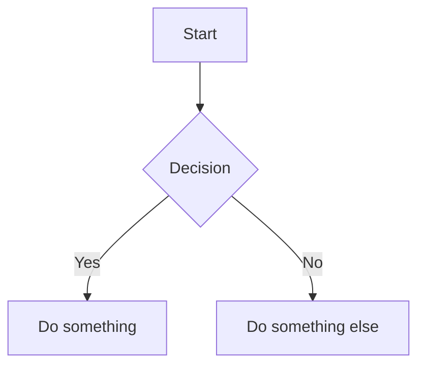

# Markdown to PDF

Converts markdown files to beautifully formatted PDFs using crossnote (same engine as mcp-printer).

## Features

- **Mermaid diagrams** — Flowcharts, sequence diagrams, etc.
- **Math equations** — KaTeX rendering
- **Syntax highlighting** — GitHub theme
- **Page numbers** — Automatic footer with page X / Y
- **GitHub-light theme** — Clean, print-optimized styling

## Usage

```bash
~/.claude/skills/md-to-pdf/scripts/md-to-pdf.mjs input.md              # Creates input.pdf
~/.claude/skills/md-to-pdf/scripts/md-to-pdf.mjs input.md output.pdf   # Custom output name
~/.claude/skills/md-to-pdf/scripts/md-to-pdf.mjs input.md --open       # Open after creating
```

## Options

| Flag | Description |
|------|-------------|
| `--open`, `-O` | Open the PDF after creating |
| `-o FILE` | Specify output filename |

## Requirements

- **Chrome or Chromium** — Auto-detected on macOS/Linux
- **Node.js** — For running the script
- **Dependencies** — Run `npm install` in the skill directory once

## How It Works

1. Uses **crossnote** (Markdown Preview Enhanced engine)
2. Injects page numbering config into front-matter
3. Renders via Chrome/Puppeteer
4. Supports Mermaid, math, code highlighting out of the box

## Examples

```bash
# Quick conversion
~/.claude/skills/md-to-pdf/scripts/md-to-pdf.mjs README.md

# Spec document for sharing
~/.claude/skills/md-to-pdf/scripts/md-to-pdf.mjs spec.md spec-v2.pdf --open

# Multiple files
for f in docs/*.md; do ~/.claude/skills/md-to-pdf/scripts/md-to-pdf.mjs "$f"; done
```

## Mermaid Example

Include in your markdown:

~~~markdown

~~~

The diagram will render as a graphic in the PDF.

## Printing

If the user wants to print the PDF, use the `/print` skill after generating.

**Workflow decision:**

| User intent | Action |
|-------------|--------|
| "Convert to PDF" | Keep the PDF |
| "Print this markdown" | Generate PDF → print with `/print` → delete PDF |
| "Create a PDF and print it" | Keep the PDF, also print |

When printing is the goal (not the PDF itself), delete the PDF after printing:

```bash
# Generate, print, cleanup
~/.claude/skills/md-to-pdf/scripts/md-to-pdf.mjs doc.md
~/.claude/skills/print/scripts/print doc.pdf
rm doc.pdf
```

The `/print` skill handles double-sided and b&w defaults automatically.

## Alias (Optional)

Add to your shell profile:
```bash
alias md-to-pdf='~/.claude/skills/md-to-pdf/scripts/md-to-pdf.mjs'
```
